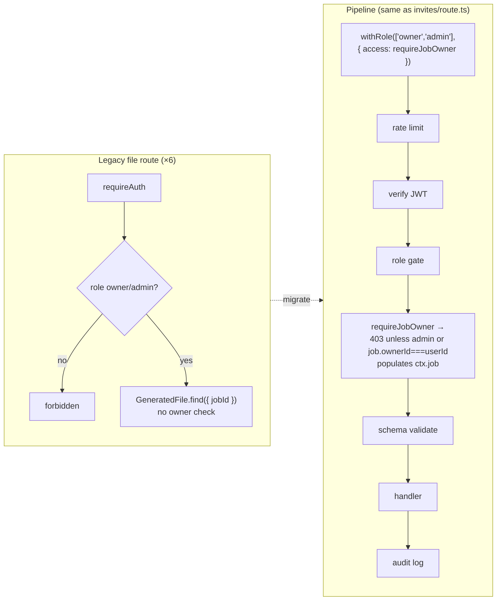

## Security & Quality Audit — Wall-Painting App (Wallo)

This is a **read-only audit** — a prioritized remediation roadmap to execute later. No source files were modified. Findings were verified against source (not just an automated scan); several scary auto-scan results were disproved (see "False alarms cleared").

The security baseline is genuinely good: a composer middleware pipeline (`withMiddleware`/`withAuth`/`withRole`), resource-access guards (`requireJobAccess`/`requireJobOwner`/`requireSubmissionAccess`/`requireUserAccess`/`requireActiveAccount`), Zod validation, Redis sliding-window rate limiting, strict CSP/HSTS/CORS on API responses, audit logging, and parameterized Mongoose queries. The core problems are a **cluster of legacy file routes that never adopted that pipeline**, plus a few missing controls and absent engineering scaffolding (tests, CI gates, monitoring).

### Findings by severity

#### 🔴 HIGH

**H-1 — Cross-owner IDOR on generated-file routes**
- **Where:** `src/app/api/jobs/[jobId]/files/route.ts` (GET), `…/files/[fileId]/route.ts` (GET, DELETE), `…/files/[fileId]/download/route.ts` (GET), `…/files/[fileId]/preview/route.ts` (GET), `…/files/generate/route.ts` (POST), `…/files/generation-status/[taskId]/route.ts` (GET).
- **Problem:** Legacy `requireAuth(request)` + manual `role !== 'owner' && role !== 'admin'` check, then `GeneratedFile.find({ jobId })` / `findOne({ _id, jobId })`. Never verifies the job belongs to the requesting owner. `generate` loads the job (`files/generate/route.ts:43`) only to resolve a storage owner.
- **Impact:** Any authenticated owner supplying another owner's `jobId` (ObjectIds leak via URLs/responses) can **list, generate, download, preview, and delete** another owner's files — job data, painter PII, photos. Cross-tenant confidentiality + integrity breach.
- **Fix:** Migrate every file route to the pipeline — `export const GET = withRole(['owner','admin'], { access: requireJobOwner })(handler)` — exactly as `src/app/api/jobs/[jobId]/invites/route.ts` already does. Read `jobId`/`fileId` from `ctx.params`, the job from `ctx.job`. Admins keep access via the role gate. This also restores audit logging + rate limiting these routes skip (covers L-2). For `generate`, replace the manual `VALID_TYPES`/`ownerInput` parsing with a schema (see H-3) and drop the duplicated Redis-queue boilerplate where the pipeline already covers it.

**H-2 — Password change without re-authentication**
- **Where:** `src/app/api/users/me/password/route.ts:14`; `ChangePasswordSchema` `src/lib/validators.ts:71-73`.
- **Problem:** Schema is `{ newPassword }` only; handler hashes and saves without checking the current password.
- **Impact:** Any active session — a stolen/borrowed 7-day token or unattended browser — can silently change the password and lock the owner out. Turns any token leak into full takeover.
- **Fix:** Add `currentPassword` to `ChangePasswordSchema`; in the handler load the user, verify with `comparePassword` (`src/lib/auth`) against `user.password`, fail with `ErrorCodes.INVALID_CREDENTIALS` on mismatch before updating. Optionally invalidate other sessions (ties to M-3).

**H-3 — Unvalidated `ownerInput` → spreadsheet/PDF formula injection**
- **Where:** `src/app/api/jobs/[jobId]/files/generate/route.ts:32` (no Zod for `ownerInput`); consumed in `workers/fileGenWorker.ts:45` → `buildExcel`/`buildPainterWiseExcel`/`buildFilePdf`; written verbatim into cells in `workers/layouts/excelLayout.ts` (`jobName`, painter-submitted `location`) and the painter/PDF layouts (`companyName`/`city`/`address`).
- **Problem:** (1) `ownerInput` reaches the BullMQ queue with no validation. (2) Strings are written verbatim into ExcelJS cells. A value starting with `=`, `+`, `-`, `@`, tab, or CR is interpreted as a **formula** when the `.xlsx` is opened (classic CSV/Excel injection) — and these files are downloaded and shared with third parties.
- **Fix:**
  - (a) Add `OwnerInputSchema` to `src/lib/validators.ts` (`companyName`/`jobName`/`city`/`address` as optional, trimmed, length-capped strings) and validate it on `generate` — ideally via the migrated `withRole(..., { schema })` so the standard `validateBody` runs. Combine with the `types` array validation.
  - (b) Add `sanitizeCell()` to `workers/layouts/excelHelpers.ts` that prefixes a leading `'` when a string begins with a formula trigger (`= + - @ \t \r`), and route all user-derived cell writes through it (`location`, `jobName`, `companyName`, `city`, `address`) across `excelLayout.ts`, `painterExcelLayout.ts`, and the PDF layouts.

##### H-1 migration shape

#### 🟠 MEDIUM

**M-1 — Account/email enumeration**
- **Where:** `auth/login/otp/send/route.ts:22` → `404 "No account found with that email"`; `auth/register/route.ts` returns distinct `409`s for email-taken vs phone-taken.
- **Fix:** OTP-send: return a generic success shape (a `sessionId`) regardless of account existence, only sending mail when the account exists. Register: prefer a generic validation message, or accept it as a known UX tradeoff and at least keep email/phone wording uniform. (Aligns with the already-neutral `forgot-password` flow.)

**M-2 — Auth token in `localStorage` + non-httpOnly status cookie** *(documented; decision deferred)*
- **Where:** `src/store/authStore.ts:43-45` — `localStorage.setItem('wallpainter_token', …)` and `document.cookie = 'wallpainter_auth_status=true; …'` (not httpOnly, not Secure).
- **Problem:** Any XSS can exfiltrate a **7-day** bearer token; the status cookie is JS-readable/forgeable. No page-level CSP (strict `default-src 'none'` lives on API responses via `helmet.ts`, not HTML pages; `next.config.ts` page headers omit CSP), so XSS blast radius is wide.
- **Option A (recommended near-term):** Keep Bearer flow; add a page-level CSP in `next.config.ts`; shorten access-token lifetime + lean on refresh; mark the status cookie `Secure`+`SameSite`.
- **Option B (robust follow-up):** Migrate to `httpOnly`+`Secure`+`SameSite` cookie on login/refresh, add CSRF protection (double-submit or origin check), update token extraction (`src/lib/middleware/auth.ts`), all client API calls, and SSR auth.
- **Recommendation:** A now, B as a planned follow-up.

**M-3 — No token revocation; suspended users linger**
- **Where:** `signToken` 7-day expiry (`src/lib/auth/index.ts`); logout is fire-and-forget (`auth/logout/route.ts`); suspension only enforced where `requireActiveAccount` runs.
- **Fix:** Add `tokenVersion` (or `sessionEpoch`) to the User model; embed in the JWT; compare in the auth/active-account check; bump on logout, password change (H-2), and admin suspend. Redis-backed (infra exists) keeps it cheap.

**M-4 — `.gitignore` ignores only exact `.env`**
- **Where:** `.gitignore:35` → `.env`. **Verified nothing sensitive is currently committed.**
- **Problem:** `.env.production` (used by `docker-compose.yml` `env_file:` and `.github/workflows/deploy.yml`) and `.env.local` are not ignored — one `git add .` from a leak.
- **Fix:** Replace with `.env*` plus negations `!.env*.example` (keep `!.env.production.example`). Preventive.

#### 🟡 LOW / hardening
- **L-1** Admins can't be suspended (`admin/users/[userId]/suspend/route.ts:23-25`) → no break-glass for a compromised admin. Consider a controlled path or `tokenVersion` bump (M-3).
- **L-2** Legacy file routes use `console.error` and bypass pino + audit + rate-limit. Resolved automatically by H-1.
- **L-3** Dockerfile runs as root — add a non-root `USER` in the runner stage.
- **L-4** Nginx TLS — `nginx/wall-app.conf` sets `ssl_protocols` but no explicit `ssl_ciphers`/OCSP stapling; add a modern cipher suite.
- **L-5** Unused dep — `helmet` in `package.json` but headers are hand-rolled (`src/lib/middleware/helmet.ts`); remove or use it.

### Missing engineering
- **No tests at all.** `package.json` declares `test`/`test:coverage` but there is no jest config and zero test files (all `*.test.*` are in `node_modules`). Wire a runner (Vitest fits Next 16 / ESM; or finish Jest) and seed tests for highest-risk units first: `src/lib/auth`, `src/lib/rbac`, the middleware guards (`requireJobOwner` etc.), `src/lib/validators`, rate limiting, and `sanitizeCell()`.
- **CI runs no quality gates.** `.github/workflows/deploy.yml` only SSHes in, pulls, builds, healthchecks. Add a pre-deploy `ci` job gating deploy on `npm ci`, `npm run lint`, `npx tsc --noEmit` (the `type-check` script exists), `npm test`, `npm audit --omit=dev`. Optionally gitleaks secret-scan.
- **No React error boundaries** — no `error.tsx`/`global-error.tsx` under `src/app/`.
- **No error monitoring** — production errors live only in pino logs; consider `@sentry/nextjs`.

### ✅ False alarms cleared (do not chase)
- **Secrets are NOT in git** — `.env`/`.env.production`/`.env.local` have empty `git log`; `.env` is gitignored. The auto-scan "committed JWT_SECRET/Mongo password" finding matched the on-disk `.env` and `.env.production.example` via glob.
- **`ctx.fail()` without `return` is correct** — typed `=> never`, throws `HttpError` (`src/lib/middleware/index.ts:104`); call sites without `return` are not auth-bypass bugs.
- **No NoSQL injection** — Mongoose queries with `ObjectId.isValid` guards; no `$where`/string-built queries.
- **Cloudinary/R2 sound** — server-side signed uploads, `STORAGE_ENV` folder isolation, 1-hour signed R2 URLs, non-guessable keys.
- **Already strong:** CORS allowlist, CSP/HSTS/X-Frame on API + via `next.config.ts`, Redis sliding-window rate limiting on auth, MongoDB audit logging.

### Prioritized remediation roadmap

| Priority | Items | Why first |
|---|---|---|
| **P0** | H-1 (file IDOR), H-2 (password re-auth) | Active cross-tenant exposure + account takeover; fixes reuse existing middleware/utils |
| **P1** | H-3 (ownerInput validation + cell sanitization), M-1 (enumeration), M-4 (.gitignore) | Injection in shared files; info leak; cheap preventive |
| **P2** | M-3 (token revocation), M-2 Option A (CSP + token-storage mitigation), CI gates, error boundaries | Hardening + safety net |
| **P3** | Tests (seed high-risk units), error monitoring, L-1…L-5, M-2 Option B (httpOnly migration) | Larger/independent efforts |

### Verification (for when fixes are implemented later)
- **H-1:** As Owner A generate a file; capture `jobId`/`fileId`. As Owner B call `GET/DELETE …/files`, `…/download`, `…/preview`, `POST …/generate` → **403**. Admin → **200**. Owner A on own job → **200**.
- **H-2:** `PUT /api/users/me/password` with wrong/missing `currentPassword` → **401/400**; correct → **200** and old password no longer authenticates.
- **H-3:** Submit `location`/`ownerInput.jobName` of `=1+1` / `@SUM(1)`; generate Excel; confirm the cell shows literal text. Unit-test `sanitizeCell()`.
- **M-1:** OTP-send for non-existent vs existing email → identical status/body; mail only for the real account.
- **M-3:** Capture token; bump `tokenVersion` (logout/password change/suspend); reuse old token → **401**.
- **M-4:** `git check-ignore -v .env.production .env.local` → ignored; `.env.production.example` → not ignored.
- **CI gates:** A PR failing `tsc`/lint/test → CI red, deploy blocked.

*No source files were modified in producing this report.*
